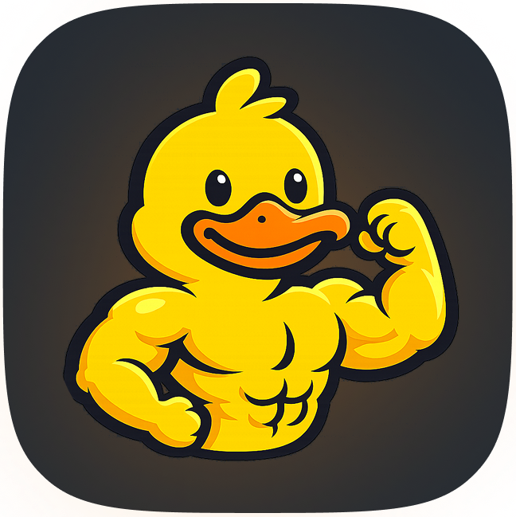

<h1 align = "center" style = "margin-bottom: 0;">
    
    <br>
    BuffBuddies
</h1>

<p align="center" style="margin-top: 0"> 
    Train together with your buddies! <br>
    Track your workouts and health with BuffBuddies!
</p>

___

## 📒 Features
### Exercises
- Choose from **581** exercises and view information and instructions about them.
- Track reps and weights of your strength training sets.
- Create workout presets for quick tracking. *(in progress)*
- View comprehensive stats about your tracked exercises.

### Gamification
- After each workout, you receive coins that you can redeem for mascots.

### Social
- Edit your public profile
- View other users profiles and add them as your friend!

## 💪 Get started
### Prerequisites
 - Rust **1.85.0** or newer

### Run the project
 Clone this repository and execute:
```bash
cargo run
```
For optimized build:
```bash
cargo run --release
```
After starting the application choose whether to run it as client or server (localhost)

Currently, BuffBuddies requires two running instances:
- one as the server 
- one as the client