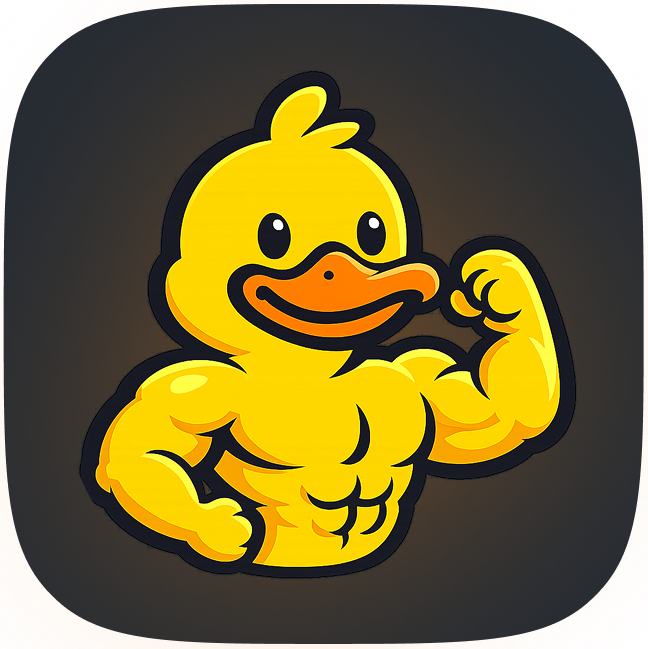
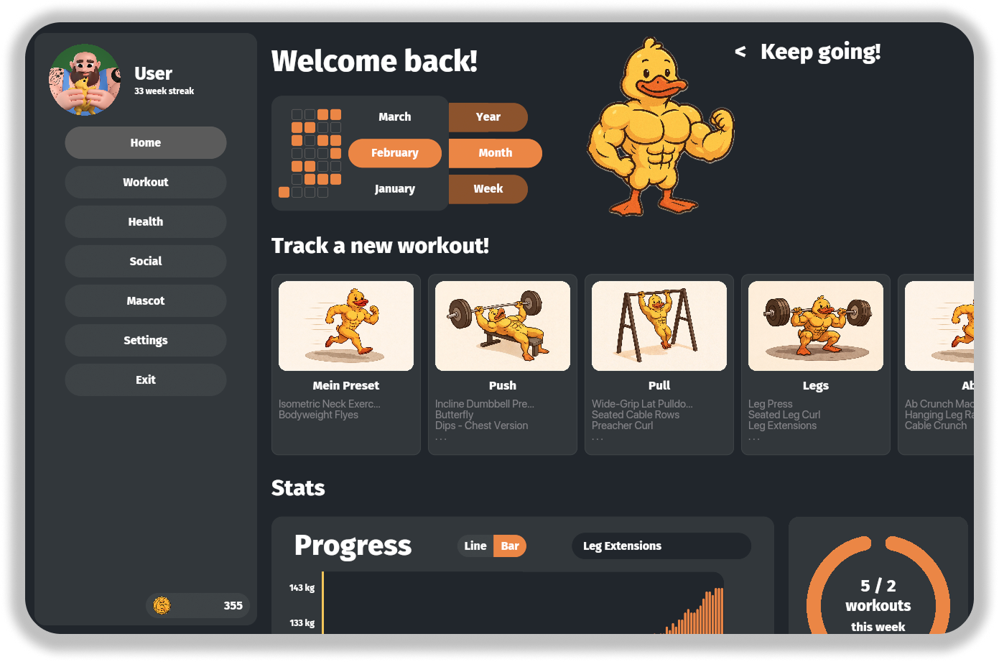
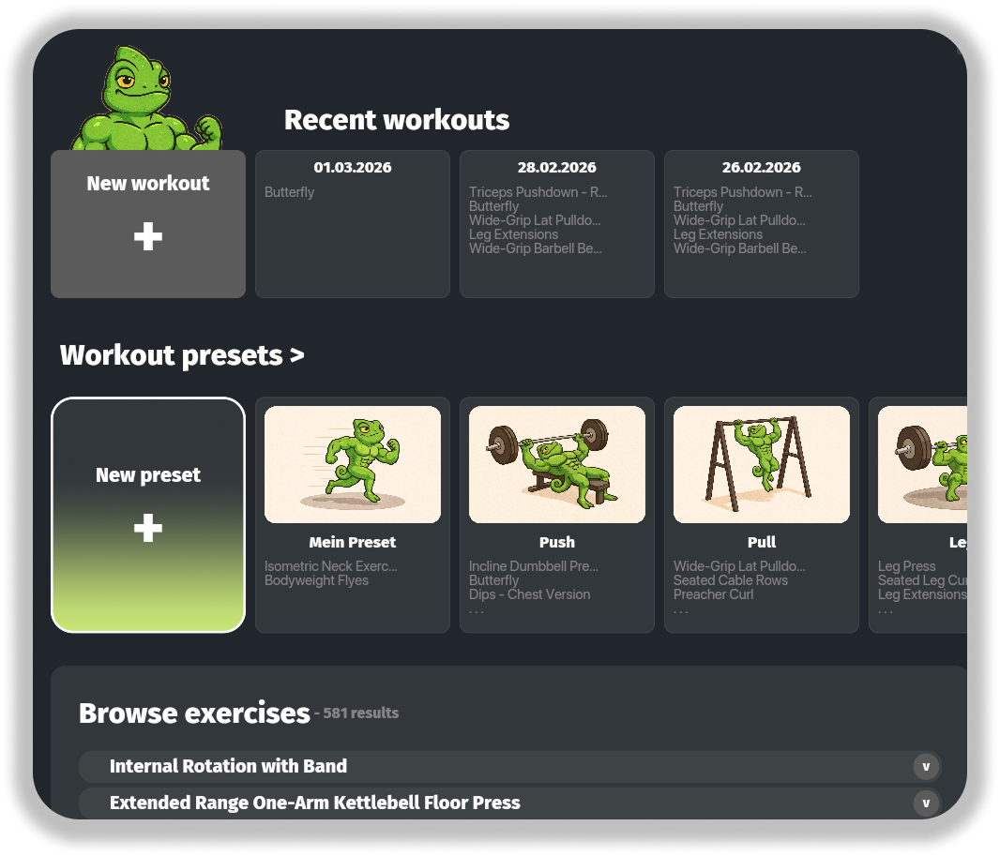
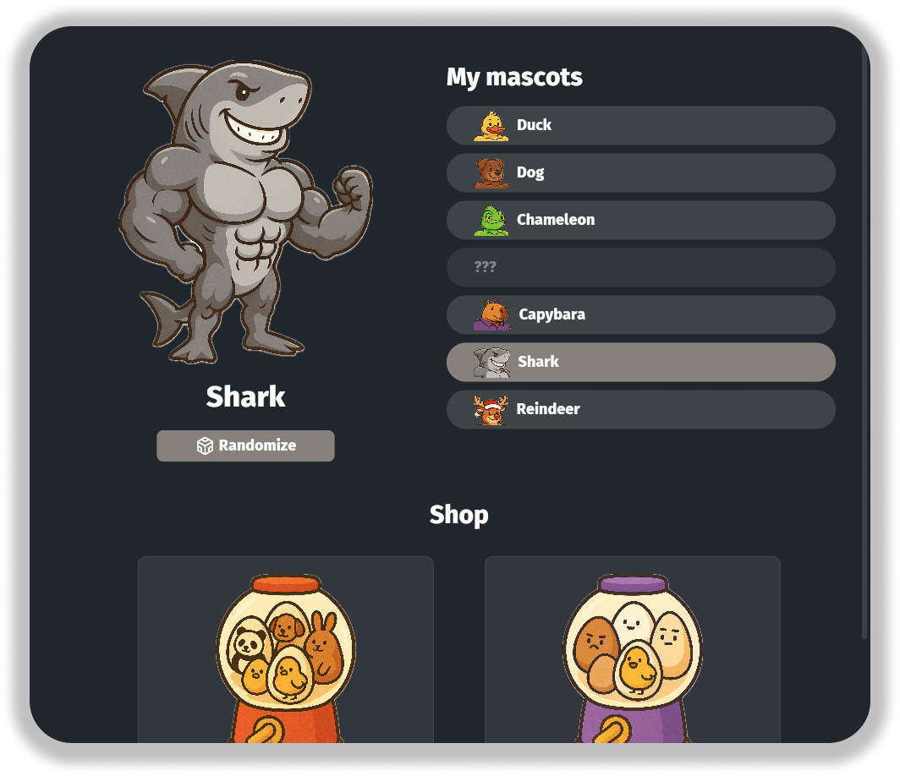
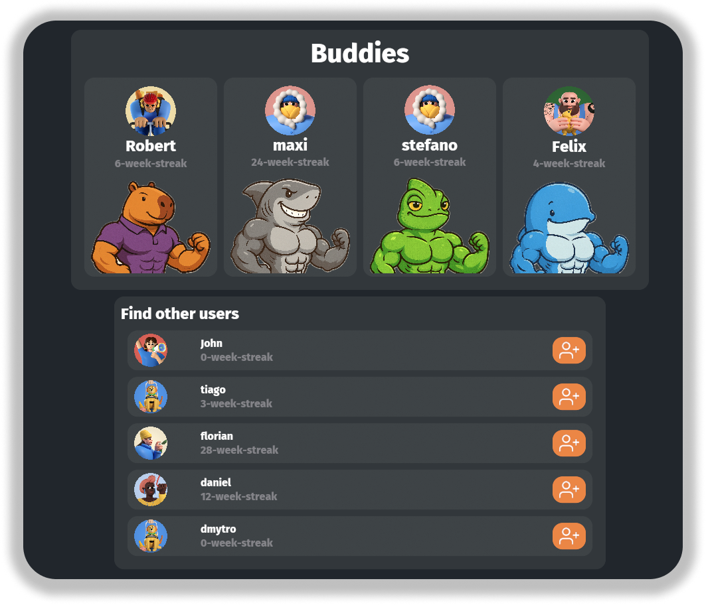
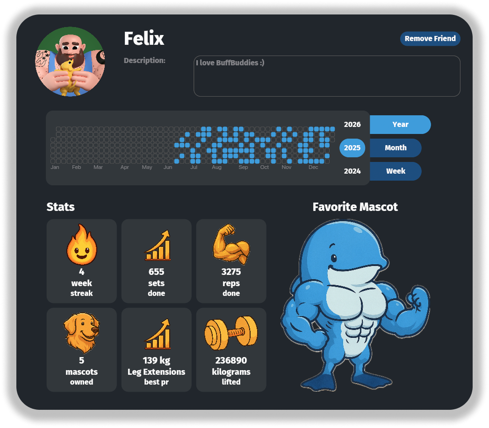
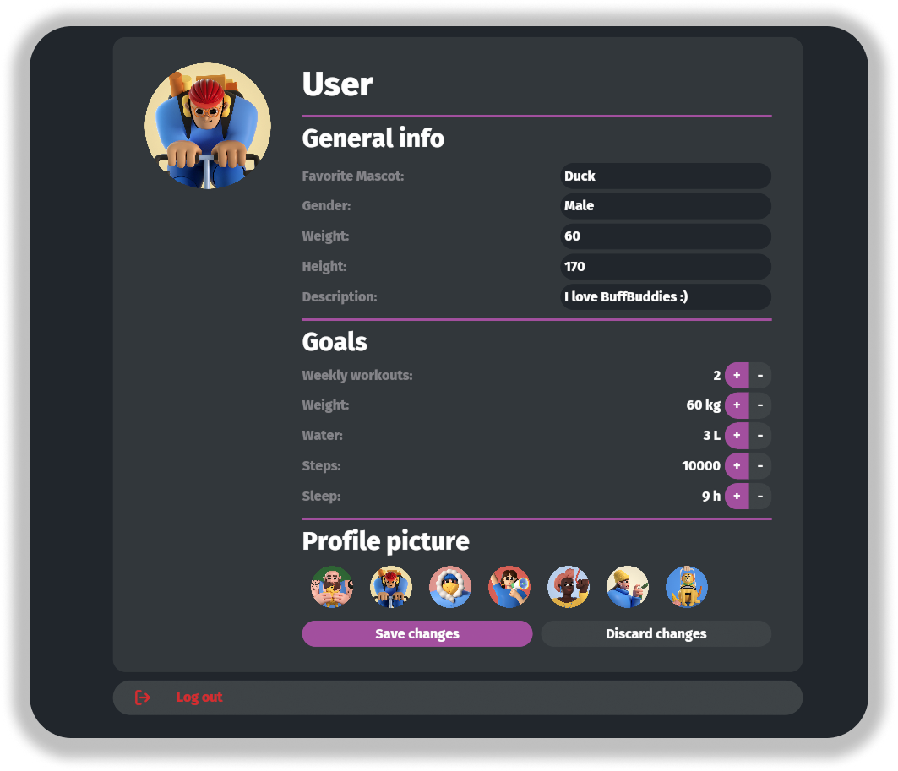
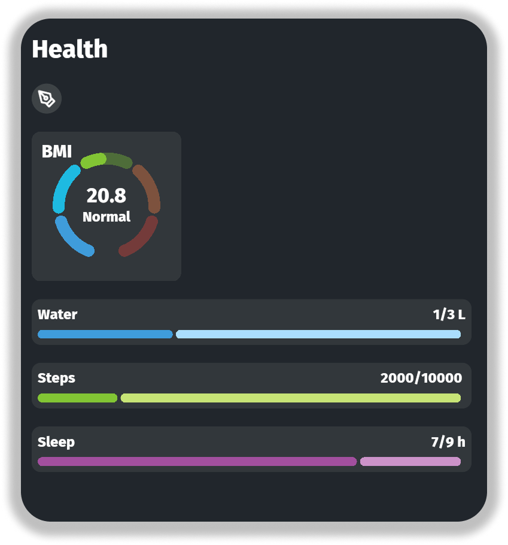

<h1 align = "center" style = "margin-bottom: 0;">
    
    <br>
    BuffBuddies
</h1>

<p align="center" style="margin-top: 0"> 
    Train together with your buddies! <br>
    Track your workouts and health with BuffBuddies!
</p>

___

## 📒 Features
### Exercises
- Choose from **581** exercises and view information and instructions about them.
- Track reps and weights of your strength training sets.
- Create workout presets for quick tracking.
- View comprehensive stats about your tracked exercises.

### Gamification
- After the first tracked workout of a day, you receive coins that you can redeem for mascots.

### Social
- Edit your public profile
- View other users profiles and add them as your friend!

## 💪 Get started
### Prerequisites
 - Rust **1.85.0** or newer

### Run the project
 Clone this repository and execute:
```bash
cargo run
```
For optimized build:
```bash
cargo run --release
```
After starting the application choose whether to run it as client or server (localhost)

>[!IMPORTANT]
> Currently, BuffBuddies requires two running instances:
> - one as the server 
> - one as the client

>[!NOTE]
> If you want to use an account with coin credit, use this user login data in the client instance:
> - Username: User
> - Password: 123

## 🐥 Preview
### Home


On the home screen, the user has a dashboard showing the app's most important functions.

- Activity widget that shows days as boxes and highlights workout days
- Workout presets to quickly track a new workout
- Chart widget to display the best weights of the sets on the respective days in a chart
- Circle widget to visualize the number of workouts this week toward the user's specific goal

### Workout
<p align="center">

</p>

The core functionality of the app!

- The user can choose from 581 exercises and track the corresponding weight used and the number of repetitions
- Preview the last three workouts
- Create and select workout presets which contain specific exercises
- View general data about all exercises, such as instructions, target muscle group, and required equipment.

### Mascot
<p align="center">

</p>

This part gamifies workouts!

- Buy mascots with coins earned by tracking workouts
- Select mascots
- Configure the color scheme of the app

### Social
<div style="display: flex; gap: 0px;">


</div>

Connect with your friends and other mascot collectors!

- Compare your stats with others<br>
- View profiles of other users<br>
- Add them as your friend<br>

### Settings
<p align="center">
  
</p>

Here you can configure your user profile!

- Configure data from three different categories.
  - General info, such as favorite mascot, weight or profile description
  - User Goals to define daily goals, like water, step or sleep goals or long term goals such as bodyweight
  - Profile picture

### Health
<p align="center">

</p>

Track your basic habits and health metrics!

- BMI widget that calculates, evaluates, and visualizes the body mass index using the user data in Settings.
- Progress displays for daily goals such as steps, water intake, and sleep, which the user can edit using the edit button on the top.

>[!NOTE]
> This screen goes beyond what we presented in the pitch, but it is not yet in its final form.

## 🎥 Video
> Watch a video walkthrough of our app [here](https://youtu.be/LtawgpuPOrQ)

## 💡 Testing philosophy

As we used iced as our gui dependency we mostly relied on extending dependencies such as iced_anim or more importantly iced_test,
but as iced_test only has one version that relies on rust version 1.88 we couldn't use it for our tests.
Also most of the code is gui code, that is very difficult to test. We mostly relied on unit tests for the logic behind the gui.
In our scenario, manual GUI testing proved to be sensible, as it allowed us to adjust GUI values and quickly create our own scenarios. We also tried building simple intregration tests but noticed recently they were inconsistent as soon as they involved the server and thus removed them for now.